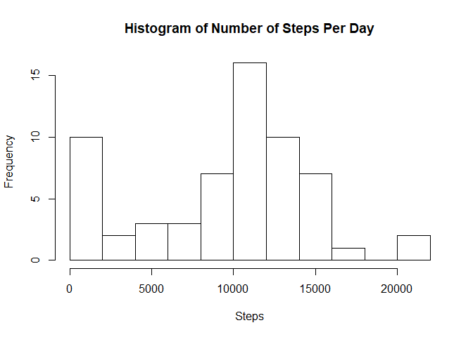
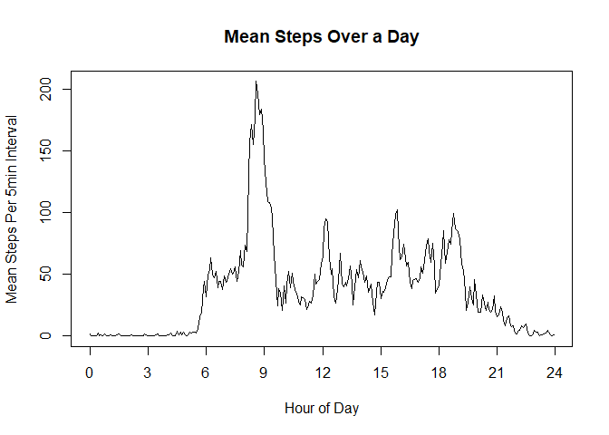
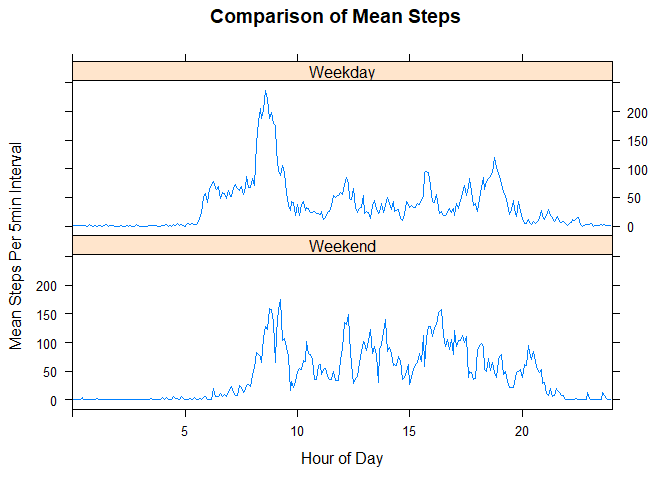

This project aims to cover the objectives provided in the Course 1 Peer Assessment of the Reproducable Research course of Coursera:

1. Load and preprocess data
1. What is the mean total number of steps taken per day?
1. What is the average daily activity pattern?
1. Impute missing values
1. Are there differences in activity patterns between weekdays and weekends?

These are the packages we'll be using in this analysis:

```r
library(readr)
library(lubridate)
library(dplyr)
library(lattice)
```

## Load and preprocess data

The data first needs loading into R, for which we use the readr package to extract directly from the compressed source:


```r
amdata <- read_csv(
    "activity.zip",
    col_types = cols(steps = col_integer(), date = col_date(), interval = col_integer())
)
amdata
```

```
## # A tibble: 17,568 x 3
##    steps date       interval
##    <int> <date>        <int>
##  1    NA 2012-10-01        0
##  2    NA 2012-10-01        5
##  3    NA 2012-10-01       10
##  4    NA 2012-10-01       15
##  5    NA 2012-10-01       20
##  6    NA 2012-10-01       25
##  7    NA 2012-10-01       30
##  8    NA 2012-10-01       35
##  9    NA 2012-10-01       40
## 10    NA 2012-10-01       45
## # ... with 17,558 more rows
```

By providing the formats to read_csv we can set the types of the columns, but the interval (textual format "HHMM" with leading zeroes truncated) requires further manupulation. Here we use sprintf to add the leading zeroes back in, then strptime to convert the time with a defined format. Because R does not have a class for "time", we then take the difference between each resulting datetime and midnight which gives us a timespan in minutes.

This is important, because the integers 55 and 100 have a difference of 45, while in the data these same values denote 55 minutes and 1 hour, a difference of only 5 minutes. Leaving this column as class Integer would skew most analysis performed on it.


```r
amdata$interval <- difftime(
    strptime(sprintf("%04.0f", amdata$interval), format = "%H%M"),
    strptime("0000", format = "%H%M"),
    units = "mins"
)
```

We can also add the Day of Week for easy summaries later:


```r
amdata$weekday <- weekdays(amdata$date)
```

## What is the mean total number of steps taken per day?
> For this part of the assignment, you can ignore the missing values in the dataset.
>
>    - Make a histogram of the total number of steps taken each day
>    - Calculate and report the mean and median total number of steps taken per day

We can answer this question by using the dplyr package to sum the total steps for each day:


```r
amdata_g_date <- group_by(amdata, date)
dailysteps <- summarise(amdata_g_date, steps = sum(steps, na.rm = TRUE))
hist(dailysteps$steps, breaks = 10, xlab = "Steps", main = "Histogram of Number of Steps Per Day")
```

<!-- -->

From there it is quite simple to calculate the mean and median:


```r
amdatamean <- mean(dailysteps$steps, na.rm = TRUE)
amdatamedian <- median(dailysteps$steps, na.rm = TRUE)

amdatamean
```

```
## [1] 9354.23
```

```r
amdatamedian
```

```
## [1] 10395
```

## What is the average daily activity pattern?
> - Make a time series plot (i.e. type = "l") of the 5-minute interval (x-axis) and the average number of steps taken, averaged across all days (y-axis)
> - Which 5-minute interval, on average across all the days in the dataset, contains the maximum number of steps?

For this objective we again use dplyr to summarise the data, this time to get the mean of the steps per interval bracket:


```r
amdata_g_interval <- group_by(amdata, interval)
intervalsteps <- summarise(amdata_g_interval, steps = mean(steps, na.rm = TRUE))
plot(
    x = as.numeric(intervalsteps$interval / 60),
    y = intervalsteps$steps,    # Convert to hours
    type = "l",
    xlab = "Hour of Day",
    ylab = "Mean Steps Per 5min Interval",
    main = "Mean Steps Over a Day",
    xaxp = c(0, 24, 8)
)
```

<!-- -->

To get the interval with the highest average number of steps, we can use `which.max` which is then added to any date (current date used for simplicity) and formatted in HH:MM format:


```r
format(as_datetime(Sys.Date()) + intervalsteps[which.max(intervalsteps$steps),]$interval, "%H:%M")
```

```
## [1] "08:35"
```

## Impute missing values
> Note that there are a number of days/intervals where there are missing values (coded as NA\color{red}{\verb|NA|}NA). The presence of missing days may introduce bias into some calculations or summaries of the data.
>
>    - Calculate and report the total number of missing values in the dataset (i.e. the total number of rows with NAs)
>    - Devise a strategy for filling in all of the missing values in the dataset. The strategy does not need to be sophisticated. For example, you could use the mean/median for that day, or the mean for that 5-minute interval, etc.
>    - Create a new dataset that is equal to the original dataset but with the missing data filled in.
>    - Make a histogram of the total number of steps taken each day and Calculate and report the mean and median total number of steps taken per day. Do these values differ from the estimates from the first part of the assignment? What is the impact of imputing missing data on the estimates of the total daily number of steps?

The read_csv function has automatically recognised NA values, so we only need to pass it to `is.na` and then the `table` function to get a count:


```r
table(is.na(amdata$steps))
```

```
## 
## FALSE  TRUE 
## 15264  2304
```
So there are 2,304 missing values that we need to impute.

For the purpose of the remaining analysis, simply taking the mean for that weekday and interval should suffice. There are 288 intervals and 7 days to take the mean of, a total of 2,016 calculations, so rather than calculate each of 2,304 cases individually it will be slightly more efficient (and much easier) to create a lookup table to refer to, for which we use dplyr to group and summarise:


```r
amdata_g_date_interval <- group_by(amdata, weekday, interval)
imputelookup <- summarise(amdata_g_date_interval, meansteps = mean(steps, na.rm = TRUE))
```

Now for the missing values, we can simply look up the mean for that weekday and interval by using `left_join` on the missing values and lookup table, then extracting the meansteps property. We save this into a new dataframe:


```r
amdatafull <- amdata
missingvalues <- is.na(amdatafull$steps)
amdatafull[missingvalues,]$steps <- left_join(amdatafull[missingvalues,], imputelookup, by = c("weekday", "interval"))$meansteps
```

Now that we have a complete dataset, we can compare it to the original using a histogram generated with the same method, using dplyr to group and summarise.

We can most tidily show this data by plotting a histogram of the new imputed data, then the original data over the top of it using an alpha channel:


```r
# Create plot based on previously plotted data
    oplot <- hist(dailysteps$steps, breaks = 10, plot = FALSE)

# Create new plot based on imputed data
    amdatafull_g_date <- group_by(amdatafull, date)
    dailystepsfull <- summarise(amdatafull_g_date, steps = sum(steps, na.rm = TRUE))
    iplot <- hist(dailystepsfull$steps, breaks = 10, plot = FALSE)

# Overlay the plots using a 0.5 alpha channel so that both are visible
    plot(iplot, col = rgb(0, 1, 0, 0.5), xlab = "Steps", main = "Histogram of Number of Steps Per Day")
    plot(oplot, col = rgb(0, 0, 1, 0.5), add = TRUE)
    legend(x = "topright", fill = c(rgb(0, 1, 0, 1/2), rgb(0, 0, 1, 1/2)), legend = c("Imputed", "Original"))
```

<!-- -->

It looks like all the days that were corrected were moved into the main cluster, which we could expect because we used the mean to impute. Only the lowest bucket of days was affected, however, implying that all missing data was for most or all of certain days (likely because the monitor was not worn at all) rather than being more sporadic.

Because we added values to days that otherwise accounted for (or close to) 0 steps, we can theorise the mean and median will go up:


```r
mean(dailystepsfull$steps, na.rm = TRUE)
```

```
## [1] 10821.21
```

```r
median(dailystepsfull$steps, na.rm = TRUE)
```

```
## [1] 11015
```

The original mean (9354) has increased by over 15%, and the median (10395) has gone up by just under 6%, which is in line with what we expect for moving low values to around the mean.

When performing analysis on this data, we can now expect more accurate results as we are not working with data heavily skewed towards inactivity.

## Are there differences in activity patterns between weekdays and weekends?
> For this part the weekdays() function may be of some help here. Use the dataset with the filled-in missing values for this part.
>
>    - Create a new factor variable in the dataset with two levels - "weekday" and "weekend" indicating whether a given date is a weekday or weekend day.
>    - Make a panel plot containing a time series plot (i.e. type="l") of the 5-minute interval (x-axis) and the average number of steps taken, averaged across all weekday days or weekend days (y-axis).

Because we already have the day of the week, we can create a true/false for whether the day is a weekend, and then convert that to a factor:


```r
isweekend <- amdatafull$weekday %in% c("Saturday", "Sunday")
amdatafull$daytype <- factor(c("Weekday", "Weekend")[as.numeric(isweekend) + 1])
```

Now we can create plots based on this factor. 


```r
amdatafull_g_interval_daytype <- group_by(amdatafull, interval, daytype)
daytypesummary <- summarise(amdatafull_g_interval_daytype, meansteps = mean(steps))
xyplot(meansteps ~ as.numeric(interval) / 60 | daytype,
   data = daytypesummary,
   type = "l",
   layout = c(1, 2),
   xlim = c(0, 24),
   xlab = "Hour of Day",
   ylab = "Mean Steps Per 5min Interval",
   main = "Comparison of Mean Steps",
   index.cond = list(c(2, 1))    # Weekend wants to display first, reverse ordering
)
```

<!-- -->

We see more and taller spikes on weekends than on weekdays, but weekdays start earlier and have a larger spike at 9am. We can theorise weekdays spike before and after the times the subjects attended work or education, but weekends were just more generally active throughout in the subject's free time.
